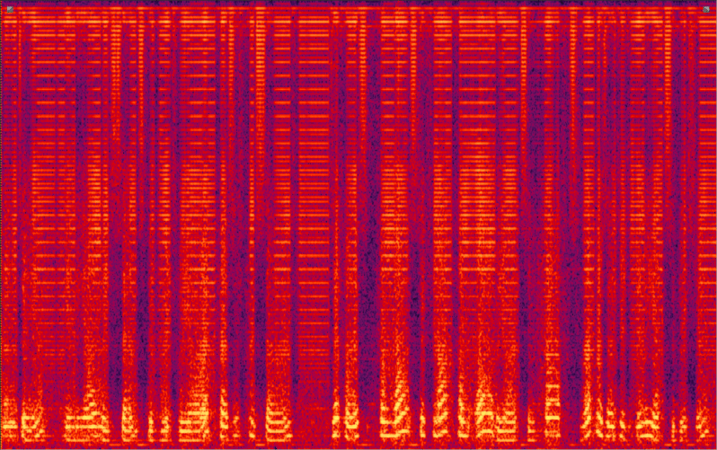
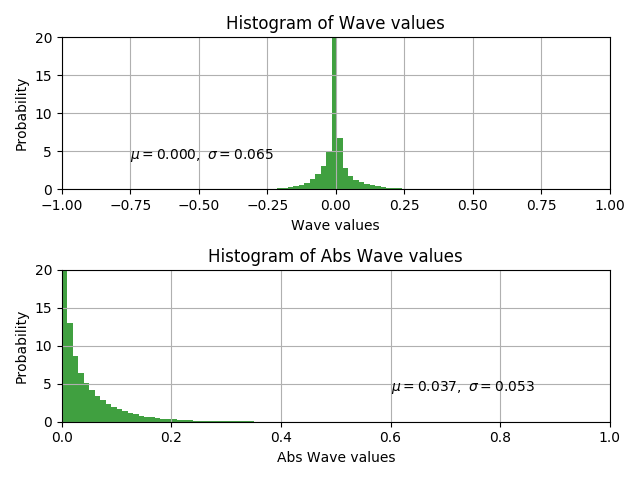

Implement parallel wavenet based on nsynth.

To make the code and configuration as simple as possible, most of the extensible properties are not extended and are set to default values.

***

How to use the code:  

Suppose a directory named `WAVE_DIR` contains all the wave files that are used to train a wavenet model.
1.  Downsample the wave files if the sampling rate is not 16k Hz
 (only 16k Hz wave files are supported for the time being).   
Librosa downsample result may be not in [-1, 1), so use `tool/sox_downsample.py` to downsample all waves first.
The arguments are quite self-evident.

2.  Build the tf_record data.
    ```
    python3 build_dataset.py --wave_dir WAVE_DIR --save_path TFR_PATH
    ```
3.  Train a teacher wavenet. `config_jsons/wavenet_mol.json` is a proper configuration file for 
    a teacher wavenet.
    ```
    python3 train_wavenet.py --config config_jsons/wavenet_mol.json --train_path TFR_PATH \
        --log_root WN_LOG_ROOT --total_batch_size 28 --gpu_id 0,1,2,3
    ```
    The training script supports multiple GPUs. Just specify the gpu ids with `--gpu_id`
    to use multiple GPUs.  
    Either `--logdir` or `--log_root` can be used to specify the directory that saves the training log and model files. 
    If `--log_root` is assigned, it will make a subdirectory named by the abbreviation of 
    the running configuration in `LOG_ROOT`. `--logdir` is used to specify an existing log directory so an
    interrupted running can be continued from the saved models.

4. Generate waves form a trained wavenet. Suppose a trained wavenet is saved in WN_LOGDIR.
    ```
    python3 eavl_wavenet.py --ckpt_dir WN_LOGDIR --source_path tests/test_data \
        --save_path tests/pred_data --gpu_id 0
    ```
5. Train a parallel wavenet.
    ```
    python3 --config config_jsons/parallel_wavenet.json --train_paht TFR_PATH \
        --teacher_dir WN_LOGDIR --log_root PWN_LOG_ROOT --total_batch_size 28 \
        --gpu_id 0,1,2,3
    ```
6.  Generate waves form a trained parallel wavenet. 
    Suppose a trained parallel wavenet is saved in PWN_LOGDIR.
    ```
    python3 eavl_parallel_wavenet.py --ckpt_dir PWN_LOGDIR --source_path tests/test_data \
        --save_path tests/pred_data --gpu_id 0
    ```
7. If multiple experiments is run on multiple servers, you may want to gather all the experiment
    logs and generated waves from each host. You can use `run_all_eval.py` script. A configuration file
    is needed to specify the hosts, users, passwords, exp_dirs and eval_scripts.
    For example:
    ```
    all_eval.json
    {
        "hosts": ["", "127.0.0.233"]
        "users": ["", "asdf"]
        "passwords": ["", "xxxx"]
        "exp_dirs": ["~/exp/logdir1", "/data/logdir2"]
        "eval_scripts": ["eval_parallel_wavenet.py", "eval_wavenet.py"]
    }
    ```
    If it is a local host, you can set hosts, users, passwords to empty strings.
    ```
    python3 run_all_eval.py -c all_eval.json -w tests/test_data -t ~/all_test_log
    ```
    
***

Pre-trained models:

wavenet model: [ns_wn-eval.tar.gz](https://drive.google.com/open?id=1P-ICvPuakLIliXlD6y7IL2lykA5Gys4T)  
Please set DOUBLE_GATE_WIDTH=True in wavenet/wavenet.py when using ns_wn-eval.  
parallel wavenet model: [ns_pwn-eval.tar.gz](https://drive.google.com/open?id=13rHT6zr2sXeedmjUOpp6IVQdT30cy66_)  
The pre-trained models are trained on [LJSpeech](https://keithito.com/LJ-Speech-Dataset/) dataset. 
The package contains the checkpoint and the confing json file.


***

Code status:

* [OK] wavenet 
* [OK] fastgen for wavenet  
* [OK] parallel wavenet  
* [OK] gen for parallel wavenet


It seems that using mu law make the training easier. So experiment it first.  
The following examples are more of functional test than gaining good waves. The network may be not trained enough.
* tune wavenet 
    * [OK] use_mu_law + ce [LJ001-0001](tests/pred_data-use_mu_law+ce/gen_LJ001-0001.wav) | [LJ001-0002](tests/pred_data-use_mu_law+ce/gen_LJ001-0002.wav)
    * [OK] use_mu_law + mol [LJ001-0001](tests/pred_data-use_mu_law+mol/gen_LJ001-0001.wav) | [J001-0002](tests/pred_data-use_mu_law+mol/gen_LJ001-0002.wav)
    * [OK] no_mu_law + mol [LJ001-0001](tests/pred_data-no_mu_law+mol/gen_LJ001-0001.wav) | [LJ001-0002](tests/pred_data-no_mu_law+mol/gen_LJ001-0002.wav)
    * [OK] no_mu_law + gauss [LJ001-0001](tests/pred_data-no_mu_law+gauss/gen_LJ001-0001-sample.wav) |
                             [LJ001-0002](tests/pred_data-no_mu_law+gauss/gen_LJ001-0001-sample.wav) 
* tune parallel wavenet 
    * use_mu_law
    * no_mu_law [Failed case 1](tests/pred_data-pwn-failed_cases/gen_LJ001-0001-stft_pow.wav)
                [Failed case 2](tests/pred_data-pwn-failed_cases/gen_LJ001-0001-stft_log.wav) 
                [A better case](tests/pred_data-pwn-failed_cases/gen_LJ001-0001-stft_abs.wav)
                
The power loss defination is important, the failed case 1 use `pow(abs(stft(y)))` as mean square error input, 
the failed case 2 use `log(abs(stft(y)))`. The are both noisy, but the noises are of different type.
A better case uses `abs(stft(y))`, it is much clearer than the previous 2 cases. Probably this is the right choice.  
I plot the refinement process of a spectrum generated by `abs(stft(y))` configuration during training.  



Proper initial mean_tot and scale_tot values have positive impact on model convergence and numerical stability.
According to the LJSpeech data distribution, proper initial values for mean_tot  and scale_tot should be 0.0 and 0.05.
I modified the initializer to achieve it.  
   
The figure is pot by [this script](tests/test_wave_distribution.py)

Decreasing loss does not indicate that everything goes well.
I found a straightforward method to determine whether a parallel wavenet is running OK. 
Compare the values of `new_x, new_x_std, new_x_abs, new_x_abs_std` listed in tensorboard to statistics of real data.
If there is no difference of many orders of magnitudes, the training process is moving in the right direction.   

e.g. The first tensorboard figure comes from a parallel wavenet trained without power lowss.
The values of `new_x, new_x_abs` are too large compared to real data. So I cannot get meaningful waves from this model.
The second is a model using power loss. Its values are much closer to real data. 
And it is generating very noisy but to some extent meaningful waves.

      
      
   
